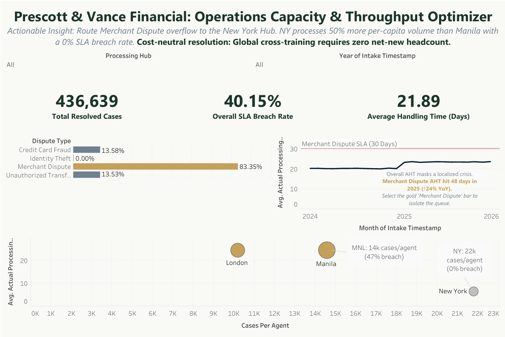

# Prescott & Vance Financial: Operations Capacity & Throughput Optimizer

*Merchant Disputes breach SLAs at 83.35% — but New York processes 50% more volume per agent at 0% breach. The fix is reallocation, not headcount.*

👉 📄 **[View Data Quality & SQL Insights Audit](Data_Audit.md)**

---

## Executive Summary

Prescott & Vance Financial saw a 23% year-over-year surge in transaction processing times, triggering a headcount budget dispute between Operations and Compliance. I built a Python-SQL-Tableau pipeline across 500,000+ legacy records to find out whether the business had a staffing problem — or a reallocation problem. **The data proved it was the latter:** the crisis is entirely isolated to Merchant Disputes, and New York's 3-agent team already has the throughput efficiency to absorb overflow without a single new hire.

---

## Business Questions

1. Is the 23% processing time surge a global capacity crisis, or is it isolated to specific transaction types and hubs?
2. Which dispute categories are breaching regulatory SLAs most severely — and by how much?
3. Can we resolve the backlog by redeploying existing staff, or does the business genuinely need net-new headcount?

---

## Data Architecture

**Source → Pipeline → Analysis → Reporting**

Extracted 500,000+ raw records from `raw_pv_operations.csv` and engineered a two-stage Python (Pandas) cleaning pipeline. A critical design decision: rather than trusting corrupted legacy text fields for geographic data, I used `Agent_ID` prefixes (`MNL`, `LND`, `NY`) as the canonical source of truth to reconstruct hub assignments — resolving ~25,000 dimension mismatches that would have invalidated all hub-level comparisons.

The cleaned data was split into two fact tables — `fact_pv_operations` (resolved cases) and `fact_pv_backlog` (open queue) — and loaded into a SQLite relational database for SQL-based EDA. Both tables were then connected to Tableau to form the semantic layer for executive reporting.

---

## Insights Deep-Dive

**The surge is real — but it's not global.**
Average handling time for Merchant Disputes in Manila and London jumped from 39 days (2024) to 48 days (2025) — a 24% YoY degradation that violently crosses the 30-day regulatory threshold. Identity Theft and Credit Card Fraud divisions are meeting SLAs with near-zero breach rates. The overall 40.15% breach rate is almost entirely driven by one dispute category.

**Merchant Disputes are the sole SLA crisis: 83.35% breach rate.**
The other three dispute types (Credit Card Fraud at 13.58%, Unauthorized Transfers at 13.53%, Identity Theft at 0.00%) are within acceptable range. This is not a company-wide burnout problem. It is one structural bottleneck with a specific geographic signature.

**New York's per-capita throughput proves cross-training is viable.**
Using LOD expressions in Tableau to calculate true agent-level capacity: New York's 3-agent team clears ~22,000 cases per agent at 0% SLA breach. Manila's 15-agent team clears ~14,000 cases per agent at a 47% breach rate. London's 15-agent team sits at ~10,000 cases per agent. The 57% throughput gap between New York and London is not explainable by volume alone — it signals a systemic process or tooling disparity in the offshore hubs.

---

## Operational Recommendations

| Priority | Finding | Recommendation |
| :--- | :--- | :--- |
| **Immediate** | Merchant Disputes breach SLAs at 83.35%. Manila and London AHT hit 48 days in 2025 — 60% over the 30-day regulatory limit. | **Implement smart-routing for near-breach escalations.** Divert high-risk Merchant Disputes in the final 5–7 days before SLA expiry to the New York hub. New York's 3 agents currently handle ~22k cases/agent, leaving absorption headroom before their breach rate is threatened. This is a configuration change, not a hiring decision. |
| **Short-Term** | Manila and London's large teams are producing far less per agent than New York — with large team sizes that should theoretically be an advantage. | **Audit offshore systemic friction.** Investigate legacy system latency, tier-2 approval bottlenecks, and automated routing rules that may be artificially stalling Merchant Dispute queues in Manila and London. The volume-to-efficiency gap is too large to be explained by SOP differences alone. |
| **Strategic** | New York's throughput superiority is proven but its 3-agent headcount creates fragility. A single attrition event collapses the routing safety valve. | **Cross-train 2–3 Manila agents on New York's Merchant Dispute workflow** to build redundant throughput capacity. This addresses the structural dependency on one hub without net-new budget. |

---

**Tech Stack:** Python (Pandas) · SQL (SQLite) · Tableau (LOD Expressions, Interactive Filters)